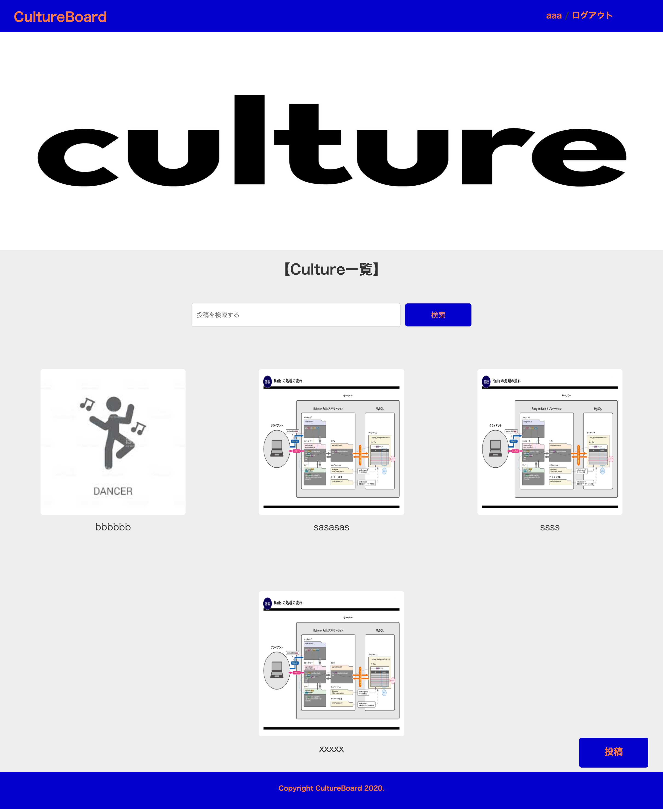

# README

# アプリ名  
CultureBoard  

# アプリケーション概要  
Zoom専用掲示板
ユーザー管理機能（新規登録、ログイン、ログアウト）  
画像付き投稿機能（投稿、編集、削除）  
コメント機能  
検索機能  
マイページ  
Amazon S3  

# URL  
[ https://cultureboard.herokuapp.com/]( https://cultureboard.herokuapp.com/)  

# テスト用アカウント  
・ID  admin  
・パスワード  2222  

# ログイン情報  
・Eメール　aaa@gmail.com  
・パスワード　aaa12345  

# 制作背景  
〜経験に繋がるアプリ作成〜
・コロナ渦でのストレス発散や自宅でのアクティビティを作り出す  
・副業の応援  

自身がzoomを使ってダンスレッスンを行なっていたのでその経験からこのアプリを作成しました。  
また同じようにzoomを使ってフィットネスのレッスンをしている友人がいたので何か力になれないかと思いました。  
コロナ太りや運動不足の方、家にいる時間が増えたことによるストレスを解消できるようにしたいです。  
時間があるからこそ何か新しいことを挑戦したり、知識やスキルを得る人へのプラットフォームを作りたかったです。  
これからの時代は複数の仕事を持つ時代と考えました。そこからこの掲示板を使ってフォローワーを増やして何か副業の役に立ちたいと思いました。  

# DEMO

# 実装予定の機能と実装理由  
AWS  世界中のユーザーにこのアプリを使用してもらうためです。  
いいね機能  ユーザーの投稿やユーザー自身の信頼度や価値を高めるために実装したいです。
SNS認証  ユーザー登録を簡易的にするためです。

# データベース設計  

## users テーブル

| Column   | Type   | Options     |
| ----------| ------ | ----------- |
| name | string | null: false |
| email    | string | null: false |

### Association

- has_many :boards
- has_many :comments

## boards テーブル

| Column | Type   | Options     |
| ------ | ------ | ----------- |
| title   | string | null: false |
| information | text | null: false |
| user_id  | integer | null: false, foreign_key: true |

### Association

- has_many :comments
- belongs_to :user

## comments テーブル

| Column | Type       | Options                        |
| ------ | ---------- | ------------------------------ |
| text | text | null: false|
| user_id   | integer | null: false, foreign_key: true |
| _id  | integer | null: false, foreign_key: true |

### Association

- belongs_to :user
- belongs_to :board

